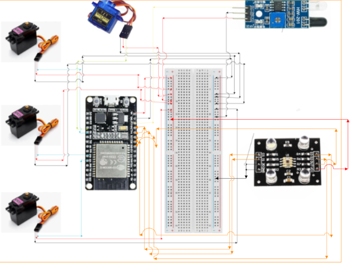
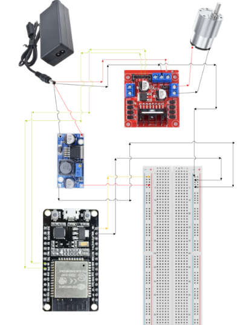

# Hệ Thống Phân Loại Màu Sắc Tự Động (IoT Robot Aim System)

> Một giải pháp tự động hóa toàn diện kết hợp phần cứng ESP32, vi điều khiển cơ khí 5 trục và nền tảng quản lý Web hiện đại (IoT).

Dự án được nghiên cứu và phát triển bởi nhóm hai sinh viên Đại học Bách Khoa TP.HCM. Hệ thống bao gồm một băng chuyền tự động và cánh tay robot 5 bậc tự do, có khả năng nhận diện, phân loại sản phẩm theo màu sắc và được giám sát theo thời gian thực qua giao diện Web Dashboard.

---
## Hình Ảnh Thực Tế Hệ Thống

<p align="center">
  
</p>

---
## Tính Năng Nổi Bật

*   **Nhận Diện Chính Xác:** Sử dụng cảm biến màu TCS3200 với hộp che chống nhiễu sáng để thu thập thông số RGB của sản phẩm trên băng chuyền.
*   **Kết Cấu Cơ Khí Vững Chắc:** Băng tải sử dụng khung gỗ định hình dễ tháo lắp, dây đai PVC bám dính tốt và động cơ DC giảm tốc (12V) đảm bảo vận hành êm ái.
*   **Tay Máy Chịu Tải Cao:** Sử dụng 3 động cơ Servo MG996R (nhông kim loại, lực kéo 9-11 kg.cm) cho các khớp chịu lực (đế, vai, cùi chỏ) và 2 Servo SG90 siêu nhẹ cho tay kẹp để tối ưu trọng tâm.
*   **Hệ Thống Điện An Toàn:** Cấp nguồn 5V riêng biệt cho Servo qua mạch giảm áp LM2596. Tích hợp tụ điện chống tụt áp và điện trở giảm chấn bảo vệ chân tín hiệu của ESP32 khỏi tia lửa điện (Back EMF).
*   **Giao Diện Web Real-time:** Dashboard giám sát trực quan bằng Python, theo dõi tọa độ khớp gốc, số lượng sản phẩm màu và tình trạng đang chạy hay tắt của hệ thống.

---

## Sơ Đồ Đấu Dây (Pinout & Wiring)

### 1. Bảng Kết Nối ESP32 (Pin Mapping)
| Bảng chân (ESP32) | Thiết bị kết nối | Chức năng |
| :--- | :--- | :--- |
| **D5** | L298N (IN3) | Điều khiển Động cơ DC Băng tải |
| **D18** | L298N (IN4) | Điều khiển Động cơ DC Băng tải |
| **D13** | FC-51 | Cảm biến hồng ngoại nhận diện vật cuối băng tải |
| **D32, D14, D27, D26** | TCS3200 (S0, S1, S2, S3) | Cấu hình tần số cảm biến màu |
| **D25** | TCS3200 (OUT) | Tín hiệu xung màu sắc |
| **D4** | Servo MG996R (SV1) | Trục Đế (Xoay trái/phải) |
| **D19** | Servo MG996R (SV2) | Trục Vai (Nâng/hạ) |
| **D21** | Servo MG996R (SV3) | Trục Cùi chỏ (Vươn/rút) |
| **D22** | Servo SG90 (SV4) | Nâng hạ tay kẹp (Nâng/hạ) |
| **D23** | Servo SG90 (SV5) | Tay kẹp (Gripper) |

### 2. Nguyên Tắc Cấp Nguồn (Cực kỳ quan trọng)
*   **Tuyệt đối không** lấy nguồn 5V từ ESP32 để cấp cho Servo.
*   Nguồn 12V từ Adapter được chia làm 2 đường: 1 đường cấp cho L298N (kéo DC), 1 đường qua LM2596 hạ xuống đúng 5V để cấp cho Servo và ESP32.
*   Nối chung tất cả chân **GND** (Mass) của ESP32, LM2596, Servo và L298N để đồng bộ tín hiệu.
*   **Mạch bảo vệ:** Cắm tụ điện song song vào dải nguồn Servo và mắc điện trở nối tiếp trên các dây tín hiệu điều khiển.

### 3. Sơ đồ mạch trực quan
**Sơ đồ đấu nối hệ thống cảm biến & Servo:**


**Sơ đồ đấu nối Động cơ DC & Hệ thống Nguồn:**


---

## Danh Sách Linh Kiện (BOM)

| STT | Tên Linh Kiện | Số Lượng |
| :--- | :--- | :--- |
| 1 | Vi điều khiển ESP32 NodeMCU 32S | 1 |
| 2 | Động cơ Servo MG996R (Nhông kim loại) | 3 |
| 3 | Động cơ Servo SG90 (Nhông nhựa) | 2 |
| 4 | Bộ băng tải mini (Khung gỗ định hình) | 1 |
| 5 | Động cơ DC giảm tốc 12V | 1 |
| 6 | Module điều khiển động cơ L298N | 1 |
| 7 | Cảm biến màu sắc TCS3200 | 1 |
| 8 | Cảm biến vật cản hồng ngoại FC-51 | 1 |
| 9 | Nguồn tổ ong / Adapter 12V-10A | 1 |
| 10 | Mạch giảm áp LM2596 (Step-down) | 1 |
| 11 | Điện trở, Tụ điện, Dây cắm Breadboard | Nhiều |

---

## Hướng Dẫn Cài Đặt & Khởi Chạy

### 1. Phần cứng (Firmware ESP32)
1. Tải và cài đặt Arduino IDE.
2. Mở file mã nguồn `.ino` trong thư mục `firmware`.
3. Cài đặt các thư viện cần thiết (ví dụ: `ESP32Servo`).
4. Kết nối board ESP32 với máy tính qua cáp Micro-USB và tiến hành Upload code.

### 2. Phần mềm (Web Dashboard)
Đảm bảo máy tính của bạn đã cài đặt Python. Hệ thống web sử dụng framework `NiceGUI` và `FastAPI` để render giao diện Real-time.

**Bước 1:** Di chuyển vào thư mục Web
```bash
cd web_app
```

**Bước 2:** Cài đặt các thư viện phụ thuộc
```bash
pip install -r requirements.txt
```

**Bước 3:** Khởi động máy chủ web
```bash
python RobotAim.py
```
*(Nếu muốn chạy ngầm máy chủ, hãy sử dụng lệnh pythonw RobotAim.py)*


**Bước 4:** Mở trình duyệt và truy cập vào địa chỉ `http://localhost:8080`.
Bạn có thể tự do bấm vào nút **Đăng ký** để tạo một tài khoản mới của riêng mình, hoặc sử dụng ngay tài khoản quản trị viên mặc định để trải nghiệm nhanh:
*   Username: `admin`
*   Password: `123456`

---
## Video Thuyết Trình & Hoạt Động

Dưới đây là các video thực tế ghi lại quá trình hoạt động của hệ thống mô hình:

* **Video Thuyết trình & Demo toàn bộ hệ thống:** [Bấm vào đây để xem](https://drive.google.com/file/d/19g9mdSmp5sloyk1nDQbA5UnhPswKEt9c/view?usp=sharing)

---

Dự án phát triển bởi: Vũ Chí Hưng & Đặng Hồng Anh - Đại học Bách Khoa TP.HCM
